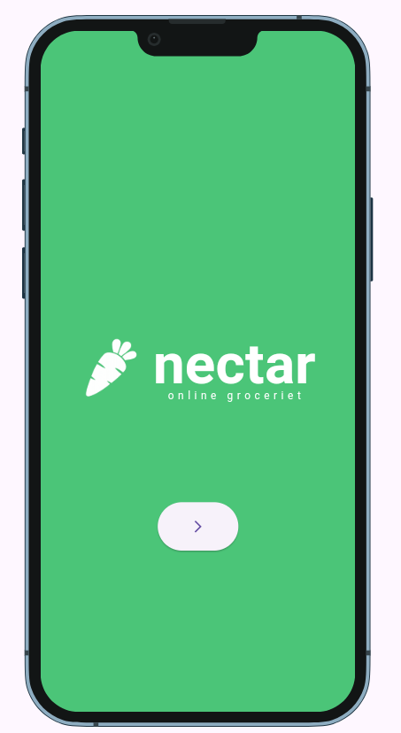
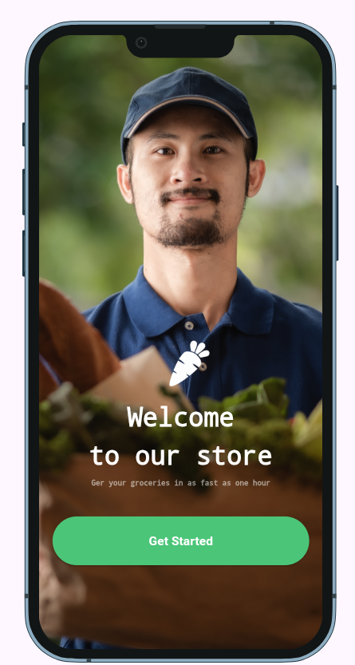

# 🍏 Nectar Grocery App - Flutter Project

A modern Flutter UI inspired by the famous Nectar Grocery application.
This project was built to practice Flutter UI development, clean code architecture, and responsive design.

---

# 📱 App Features

The application includes:

* Splash Screen
* Welcome Screen
* Login & Sign Up Screens
* Bottom Navigation Bar
* Modern and clean UI
* Responsive Design for different screen sizes

---

# 🚀 Features

✅ Modern UI Design using Flutter
✅ Clean Code Architecture
✅ Reusable Widgets
✅ Bottom Navigation Bar for smooth navigation
✅ TextField Validation
✅ Responsive Design for all devices
✅ Organized project structure
✅ Smooth and simple User Experience
✅ Separation of Widgets, Constants, and Screens
✅ Beginner & Intermediate friendly project

---

# 🛠️ Technologies Used

* Flutter
* Dart
* Material Design

---

# 🎯 What I Learned

Through this project, I practiced:

* Building UI with Flutter
* Organizing Flutter projects
* Creating reusable widgets
* Implementing Validation
* Using Bottom Navigation Bar
* Improving UI/UX
* Navigation between screens

---

# 📸 Design Inspiration

The design is inspired by the famous *Nectar Grocery App* with some custom improvements and modifications.

---

## Screenshots

# 👨‍💻 Developer

*EngOmar*
Developed With Flutter♥️
